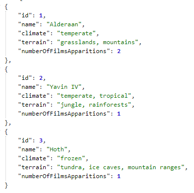

# hitchhikers-guide

This repository helds the assignment for AmeDigital. The requisites can be found [here](https://github.com/AmeDigital/challenge-back-end).

## Prerequisites

* JDK 8
* Maven

## How to run it

Clone this repository.

`git clone https://github.com/ap3xx/hitchhikers-guide.git`

Execute the following command (in the root of the project):

`mvn spring-boot:run`

## How to run the automated tests

`mvn test`

## API Documentation

The API documentation can be found in the following link:

`http://localhost:8081/api/swagger-ui.html`

_Obs: assuming you are running it at localhost_

## Sample Data

The project will be already start with a sample populated database, as seen in the following image:

With this sample data you can already test:

* Get by id
* Get by name
* Insert
* Update
* Delete

## Built with

* [**Spring Boot**](https://spring.io/projects/spring-boot)
* [**Lombok**](https://projectlombok.org/)
* [**Swagger**](https://swagger.io/)

## Author

* **Flávio Teixeira** - [ap3xx](https://github.com/ap3xx)